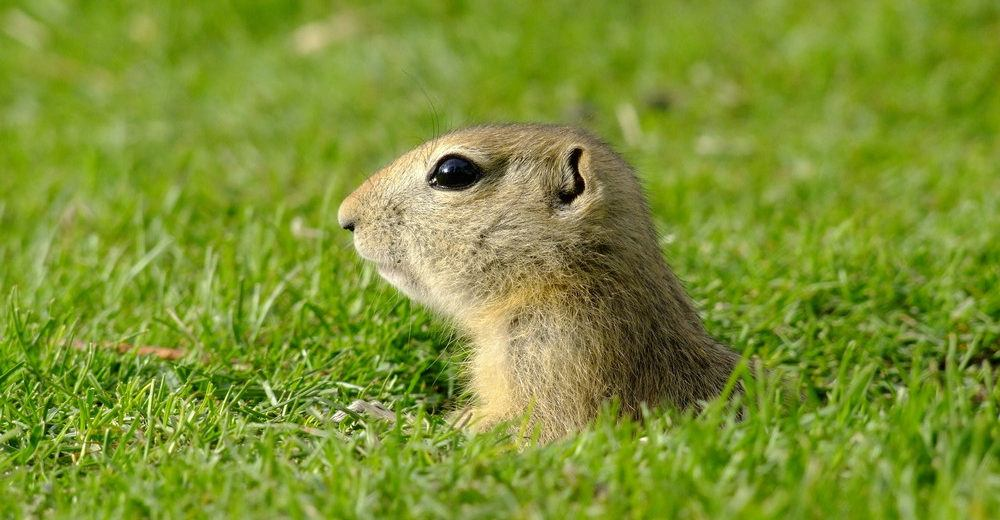

# Flask-Gopher

<p align="center">
  
</p>

<p align="center">
  <a href="https://pypi.python.org/pypi/flask-gopher/">
    
  </a>
  <a href="https://pypi.python.org/pypi/flask-gopher/">
    
  </a>
  <a href="https://travis-ci.org/michael-lazar/flask-gopher">
    
  </a>
  <a href="https://coveralls.io/github/michael-lazar/flask-gopher?branch=master">
    
  </a>
</p>

## Installation

```
pip install flask_gopher
```
