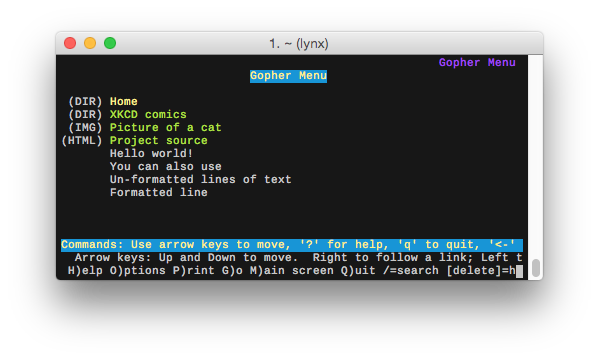
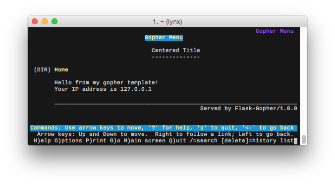

<h1 align="center">Flask-Gopher</h1>

<p align="center">A <a href="http://flask.pocoo.org/">Flask</a> extension to support the <a href="https://en.wikipedia.org/wiki/Gopher_(protocol)">Gopher</a> protocol.</p>

<p align="center">
  
</p>

<p align="center">
  <a href="https://pypi.python.org/pypi/flask-gopher/">
    
  </a>
  <a href="https://pypi.python.org/pypi/flask-gopher/">
    
  </a>
  <a href="https://github.com/michael-lazar/flask-gopher/actions">
    
  </a>
</p>

## Contents

* [Demo](#demo)
* [About](#about)
* [Quickstart](#quickstart)
* [Installation](#installation)
* [Building Gopher Menus](#building-gopher-menus)
* [Using Templates](#using-templates)
* [Gopher and WSGI](#gopher-and-wsgi)
* [Gopher Protocol References](#gopher-protocol-references)

## Demo

A live demonstration of the Flask-Gopher server is available in
gopherspace at the following URL:

---

<p align="center">
<b><a href="gopher://mozz.us:7005">gopher://mozz.us:7005</a></b><br>
</p>

---

## About

*What is gopher?*

Gopher is an alternative to the World Wide Web that peaked in
popularity in the early 90's. There are still a handful of gopher
sites maintained by enthusiasts; you can learn more about its history
at [floodgap](http://gopher.floodgap.com/gopher/).

*What is flask-gopher?*

Flask-Gopher is a Flask extension that adds a thin *Gopher -> HTTP*
compatability layer around the built-in webserver. It allows you to
build fully [RFC 1466](https://tools.ietf.org/html/rfc1466) compliant
gopher servers, with complete access to Flask's routing, templating
engine, debugger, and more!

*Who is this for?*

I created this extension because I wanted to experiment with building
dynamic gopher applications, and I felt limited by the lack of
flexibility in other gopher servers. The target audience is web
developers with experience using a high level web framework like
Django or Ruby on Rails. You should feel comfortable writing python
code and cross-referencing the official Flask documentation.

## Quickstart

```python
from flask import Flask, url_for
from flask_gopher import GopherExtension, GopherRequestHandler

app = Flask(__name__)
gopher = GopherExtension(app)

@app.route('/')
def index():
    return gopher.render_menu(
        gopher.menu.title('My GopherHole'),
        gopher.menu.dir('Home', url_for('index')),
        gopher.menu.info("Look Ma, it's a gopher server!"))

if __name__ == '__main__':
   app.run('127.0.0.1', 70, request_handler=GopherRequestHandler)
```

## Installation

This package requires **Python v3.7 or higher**

```
pip install flask_gopher
```

## Building Gopher Menus

Gopher menus are structured text files that display information
about the current page and contain links to other gopher resources.
A gopher menu is loosely equivalent to an HTML document with only
``<a>`` and ``<span>`` tags. Each line in the menu has a *type*
that describes what kind of resource it links to (text, binary, html,
telnet, etc.).

Flask-Gopher provides several helper methods for constructing gopher
menu lines:

| Method         | Link Descriptor | Meaning                                 |
|----------------|-----------------|-----------------------------------------|
| menu.text      | 0               | Plain text file                         |
| menu.dir       | 1               | Gopher menu                             |
| menu.ccso      | 2               | CCSO database; other databases          |
| menu.error     | 3               | Error message                           |
| menu.binhex    | 4               | Macintosh BinHex file                   |
| menu.archive   | 5               | Archive file (zip, tar, gzip)           |
| menu.uuencoded | 6               | UUEncoded file                          |
| menu.query     | 7               | Search query                            |
| menu.telnet    | 8               | Telnet session                          |
| menu.bin       | 9               | Binary file                             |
| menu.gif       | g               | GIF format graphics file                |
| menu.image     | I               | Other Image file                        |
| menu.doc       | d               | Word processing document (ps, pdf, doc) |
| menu.sound     | s               | Sound file                              |
| menu.video     | ;               | Video file                              |
| menu.info      | i               | Information line                        |
| menu.title     | i               | Title line                              |
| menu.html      | h               | HTML document                           |

Most of these methods require a text description for the link, and
will accept a path selector and a host/port. They return a line of
text that has been pre-formatted for a gopher menu. You can then pass
all of the lines along into ``gopher.render_menu()`` to build the
response body.

```python
@app.route('/')
def index():
    return gopher.render_menu(
        # Link to an internal gopher menu
        gopher.menu.dir('Home', '/'),

        # Link to an external gopher menu
        gopher.menu.dir('XKCD comics', '/fun/xkcd', host='gopher.floodgap.com', port=70),

        # Link to a static file, using flask.url_for() to build a relative path
        gopher.menu.image('Picture of a cat', url_for('static', filename='cat.png')),

        # Link to an external web page
        gopher.menu.html('Project source', 'https://github.com/michael-lazar/flask-gopher'),

        # A text info line
        gopher.menu.info('This is informational text'),

        # Plain text will be converted into info lines
        "\n    There's no place\n    like ::1\n",

        # You can also format your links manually
        "0About this page\t/about.txt\t127.0.0.1\t8007")
```

Here's what the rendered menu looks like as plain text:

```
$ curl gopher://localhost:8007
1Home	/	127.0.0.1	8007
1XKCD comics	/fun/xkcd	gopher.floodgap.com	70
IPicture of a cat	/static/cat.png	127.0.0.1	8007
hProject source	URL:https://github.com/michael-lazar/flask-gopher	127.0.0.1	8007
iThis is informational text	fake	example.com	0
i 	fake	example.com	0
i    There's no place	fake	example.com	0
i    like ::1	fake	example.com	0
i 	fake	example.com	0
0About this page	/about.txt	127.0.0.1	8007
```

And here's what it looks like inside of a gopher client:

<p align="center">
  
</p>

## Using Templates

You can use Flask's Jinja2 templating engine to layout gopher menus.
Flask-Gopher attaches ``gopher`` to the template namespace so you can
access the menu helper functions. The recommended naming convention
for gopher template files is to add a *.gopher* suffix. An example
template file is shown below:

**templates/example_menu.gopher**

```
{{ 'Centered Title' | underline('-') | center }}

{{ gopher.menu.dir('Home', url_for('index')) }}

Hello from my gopher template!
Your IP address is {{ request.remote_addr }}

{{ '_' * gopher.width }}
{{ ('Served by ' + request.environ['SERVER_SOFTWARE']) | rjust }}
```

Call ``gopher.render_menu_template()`` from inside of your route to
compile the template into a gopher menu.

```python
@app.route('/')
def index():
    return gopher.render_menu_template('example_menu.gopher')
```

<p align="center">
  
</p>

## Gopher and WSGI

Python's WSGI (Web Server Gateway Interface) is an established API
that defines how python web servers (gunicorn, mod_wsgi, etc)
communicate with application frameworks (Flask, Django, etc). It
defines a clean boundary between low-level socket and request
handling, and high-level application logic.

WSGI was designed to be a very simple and flexible API, but at its
heart it's built around HTTP requests. As such, it incorperates some
HTTP specific components like request/response headers and status
codes. Gopher is more simplistic and doesn't use these components.
Here's an example of the difference in fetching a document with the
two protocols:

<table>
<tr><th colspan=2>HTTP</th><th colspan=2>Gopher</th></tr>
<tr><th>request</th><th>response</th><th>request</th><th>response</th></tr>
<tr>
<td width="20%"><pre>
GET /path HTTP/1.1
Accept: text/plain
Accept-Charset: utf-8
...more headers
</pre></td>
<td width="20%"><pre>
HTTP/1.1 200 OK
Server: Apache
Content-Type: text/html
...more headers<br>
(body)
</pre></td>
<td width="20%"><pre>/path\r\n</pre></td>
<td width="20%"><pre>(body)</pre></td>
</tr></table>

In order to resolve the differences between gopher and HTTP, *
*Flask-Gopher** implements a custom ``GopherRequestHandler``. The
handler hooks into the WSGI server (``werkzeug.BaseWSGIServer``). It
reads the first line of every TCP connection and determines which
protocol the client is attempting to use. If the client is using
gopher, the following assumptions are made:

- Set the request's *REQUEST_METHOD* to ``GET``
- Set the request's *SERVER_PROTOCOL* (e.g. *HTTP/1.1*) to ``gopher``
- Set the request's *wsgi.url_scheme* (e.g. *https*)  to ``gopher``
- Discard the response status line
- Discard all response headers

Doing this makes a gopher connection *appear* like a normal HTTP
request from the perspective of the WSGI application. It also provides
metadata hooks that can be accessed from the Flask request. For
example, you can respond the the request differently depending on
which protocol is being used:

```python
@app.route('/')
def index():
    if flask.request.scheme == 'gopher':
        return "iThis was a gopher request\tfake\texample.com\t0\r\n"
    else:
        return "<html><body>This was an HTTP request</body></html>"
```

## Gopher Protocol References

- https://tools.ietf.org/html/rfc1436 (1993)
- https://tools.ietf.org/html/rfc4266 (2005)
- https://tools.ietf.org/html/draft-matavka-gopher-ii-03 (2015)
- https://www.w3.org/Addressing/URL/4_1_Gopher+.html

An interesting side note, the python standard library used to contain
its own gopher module. It was deprecated in 2.5, and removed in
2.6. (<em>https://www.python.org/dev/peps/pep-0004/</em>)


>     Module name:   gopherlib
>     Rationale:     The gopher protocol is not in active use anymore.
>     Date:          1-Oct-2000.
>     Documentation: Documented as deprecated since Python 2.5.  Removed
>                    in Python 2.6.

A reference gopher client still exists in the old python SVN
trunk: https://svn.python.org/projects/python/trunk/Demo/sockets/gopher.py
